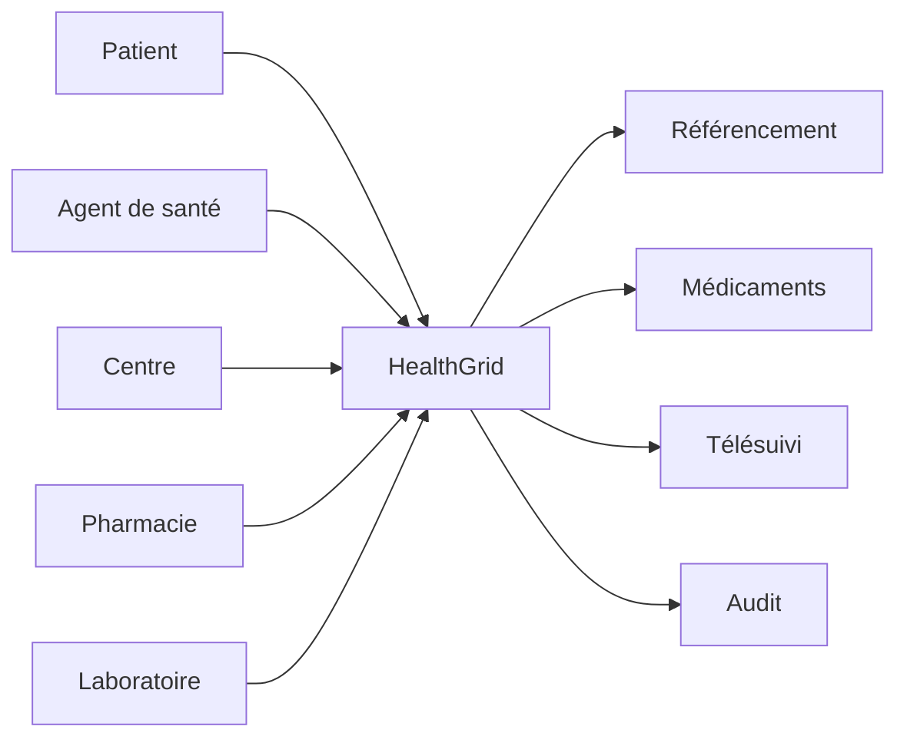

# HashCode HealthGrid

> Infrastructure numérique de coordination des soins pensée pour les contextes à ressources et connectivité limitées.

**Domaine:** Web & Software Engineering · **Programme:** HashCode Global Impact · **Statut:** Research / MVP discovery

## Problème
Patients, agents de santé, centres, pharmacies et laboratoires disposent souvent d'informations fragmentées. HealthGrid vise la coordination, pas le remplacement du professionnel de santé.

## Vision
Faciliter orientation, référencement, disponibilité des ressources, suivi et continuité des soins avec un mode dégradé.

## Cartographie

## MVP
Profil minimal, référencement, disponibilité, rendez-vous, notifications, synchronisation offline et audit.

## Garde-fous
Validation humaine pour les décisions sensibles, minimisation des données, traçabilité, sécurité et évaluation avant tout usage clinique.

## Impact
Temps d'orientation, temps d'attente, continuité des références, disponibilité des ressources et adoption.

## Contribuer
Voir : https://github.com/HashCode-Reboot/hashcode-contributors

**Doctrine HashCode:** *Build for Africa. Scale for Humanity.*