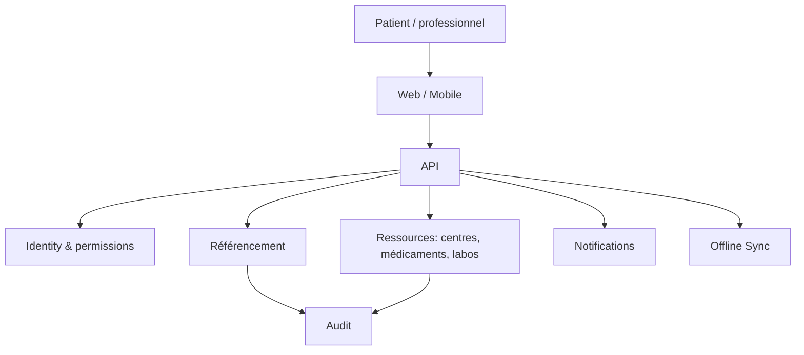

# Architecture — HealthGrid

## Principes

Architecture offline-first, synchronisation explicite, chiffrement, contrôle d'accès par rôle, audit et minimisation des données.

Les données médicales doivent être isolées des données opérationnelles lorsque possible. Toute fonction clinique sensible doit avoir une supervision humaine et une procédure d'évaluation.